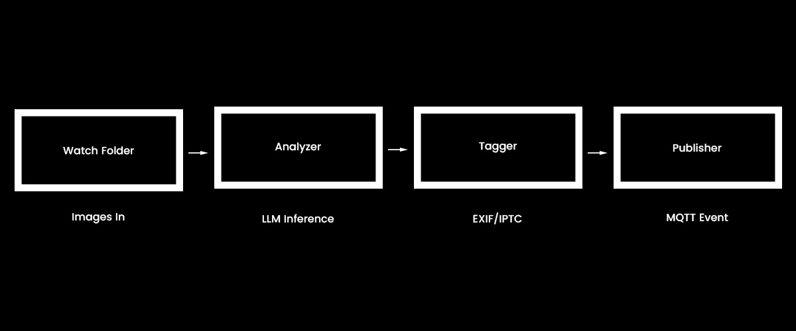

# InsightPipe


> 🧠 LLM-powered image classification — offline, modular, and camera-agnostic

**InsightPipe** decouples image analysis from camera infrastructure, letting you classify, tag, and broadcast image events from any source using flexible LLM inference. It’s designed for post-processing output from tools like Frigate, but doesn’t rely on their internal models or formats.

---

## 🔒 Local Model Support

### 🧠 Private LLM Inference (No Cloud Required)

InsightPipe connects to local models via [Ollama](https://ollama.com), giving you full control over:

- ✅ What model is used  
- ✅ What prompt is passed  
- ✅ Where results are stored or sent

This allows you to run fully offline pipelines—no external API calls, no image uploads, no cloud dependencies.

Models are served locally using `ollama run`, and you can easily swap between different models like:

```
ollama run gemma ollama run openhermes
```

If your workflow demands **zero cloud contact**, InsightPipe is built for you.

---

## 🔧 Key Features

- Prompt-driven detection using local LLMs
- Modular pipeline for scan → analyze → tag → publish
- Supports reprocessing with multiple models and prompts
- Metadata tagging (IPTC/XMP) for tools like Adobe Bridge, Photoshop, Immich
- MQTT broadcasting for downstream event integration
- Configurable output directories and file handling (move/copy)

---

## 📐 Architecture Overview




---

## 🚀 Getting Started

```
git clone https://github.com/donnievawter/insightpipe cd insightpipe python3 -m venv venv-insight source venv-insight/bin/activate pip install -r requirements.txt
```

Update `config.yaml` and `.env` with your preferred model, prompt, watch directory, and output settings.

---

## 🛠 Configuration

`config.yaml`
```
watch_dir: /Volumes/wildlife 
model_name: gemma-3b
prompt: Describe people, animals or vehicles in this image...
output_dir: /Volumes/processed 
output_mode: copy 
ollama_url: http://localhost:11434
poll_interval: 3 
stabilization_interval: 2
```
`.env`
```
MQTT_HOST=localhost
MQTT_PORT=1883
MQTT_USER=username
MQTT_PASSWORD=passwor
MQTT_TOPIC=wildlife/insightpipe

```
---
## Requirements
- Python 3.10+
- Ollama with a vision-capable model (e.g., `llava`)
- ExifTool installed

---

## 🌱 Philosophy

InsightPipe was designed to remain general. It doesn’t presume what image came from which source, doesn’t embed camera logic, and doesn’t enforce classifier formats. This lets you extend it across:

- Wildlife tracking  
- Security camera systems  
- Social media event prepping  
- Batch inference for archival images

Think of it not as a plugin, but a flexible bridge from perception to insight.
